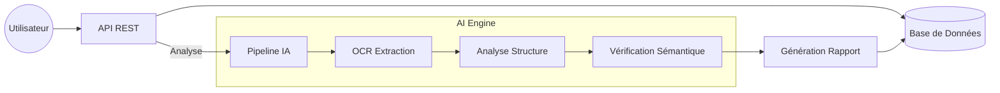

# 📂 VérifDossier IA

**Solution Intelligente de Vérification de Dossiers Administratifs**

VérifDossier IA est une API backend conçue pour automatiser l'analyse, la vérification et la validation de dossiers administratifs (bourses, inscriptions, recrutements). Elle utilise l'intelligence artificielle pour réduire les rejets dus aux erreurs humaines.

---

## 🚀 Fonctionnalités Clés

*   **📄 Extraction Intelligente (OCR)** : Conversion automatique des documents (PDF, Images) en données exploitables.
*   **✅ Vérification de Conformité** : Détection des pièces manquantes et validation des formats.
*   **🧠 Analyse Sémantique** : Détection d'incohérences (dates, noms) via NLP.
*   **📊 Rapport Automatisé** : Génération d'un score de conformité et de recommandations correctives.

---

## 🏗️ Architecture Technique

Le projet repose sur une architecture modulaire **Django** séparant la logique métier du moteur d'IA.

### 🧩 Structure des Modules

| Module | Rôle | Technologies |
| :--- | :--- | :--- |
| **`back/`** | **Gestion Métier** <br> Gère les utilisateurs, les dossiers, les documents et expose l'API REST. | Django REST Framework, PostgreSQL/SQLite |
| **`ai_engine/`** | **Cerveau IA** <br> Pipeline de traitement : OCR, analyse de layout et vérification sémantique. | PaddleOCR, LayoutLM, Llama (Placeholders) |

### 🔄 Flux de Données (Pipeline)



---

## 🛠️ Installation & Démarrage

### Prérequis
*   Python 3.10+
*   Pip

### 1. Installation
```bash
# Cloner le projet
git clone <votre-repo>
cd project_ia

# Installer les dépendances
pip install django djangorestframework markdown django-filter
```

### 2. Configuration
```bash
cd backend_ai

# Appliquer les migrations
python manage.py makemigrations
python manage.py migrate
```

### 3. Lancement
```bash
# Démarrer le serveur de développement
python manage.py runserver
```

---

## 🔌 API Endpoints (Aperçu)

L'API est accessible via `/api/`. Voici les routes principales :

*   `POST /api/dossiers/` : Créer un nouveau dossier.
*   `POST /api/documents/` : Ajouter une pièce jointe (PDF/Image).
*   `POST /api/dossiers/{id}/analyze/` : **Lancer l'analyse IA**.
*   `GET /api/reports/{id}/` : Consulter le rapport de conformité.

---

## 📂 Structure du Projet

```text
backend_ai/
├── back/                 # 🏢 Application Métier
│   ├── models.py         # Définition des Dossiers & Rapports
│   ├── views.py          # Endpoints API
│   └── services.py       # Logique de liaison avec l'IA
│
├── ai_engine/            # 🧠 Moteur IA
│   ├── pipeline.py       # Orchestrateur du traitement
│   ├── ocr/              # Module d'extraction de texte
│   ├── layout/           # Analyse visuelle des documents
│   └── analysis/         # Vérification de cohérence (LLM)
│
└── manage.py             # CLI Django
```

---
*Projet GL3 - Init IA - 2025*
